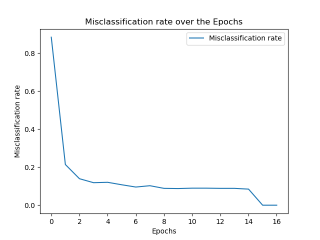

# neural_network

Neural network with one hidden layer, which is trained with the mnist dataset for handwritten digits. Input for the nn. is a 28x28 binary representation vector of each digit, making the input layer a size of 784 neurons. Ouput is a 1x10 vector which represents the certainty of the nn. that the current handwritten digit is the respective digit. The nn. is trained with gradient descent and mini batches.

All the other meta params can be varied. The current params seem to work best, performing with a missclassification rate of 6-10%.

The nn is also implemented with tensorflow.

 
